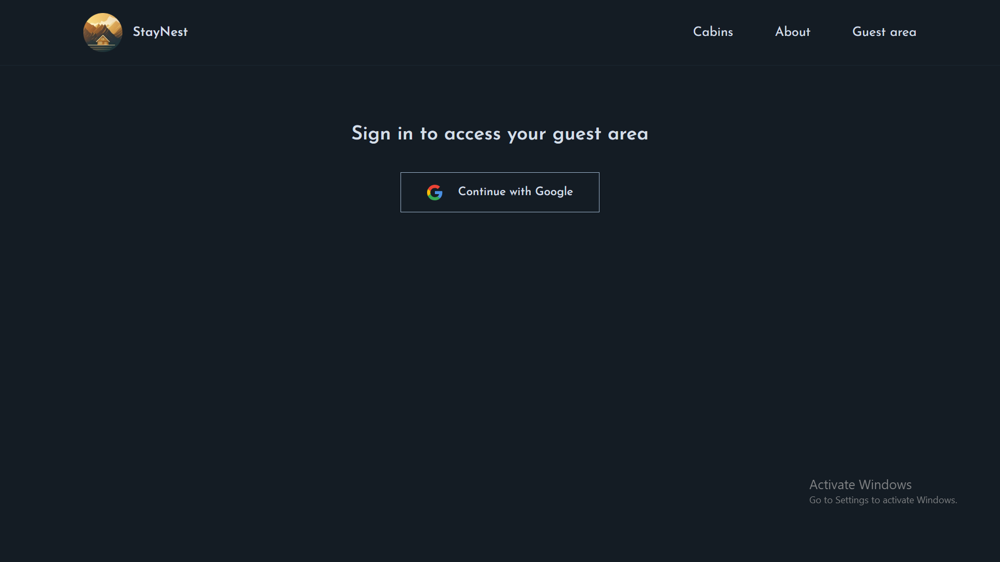
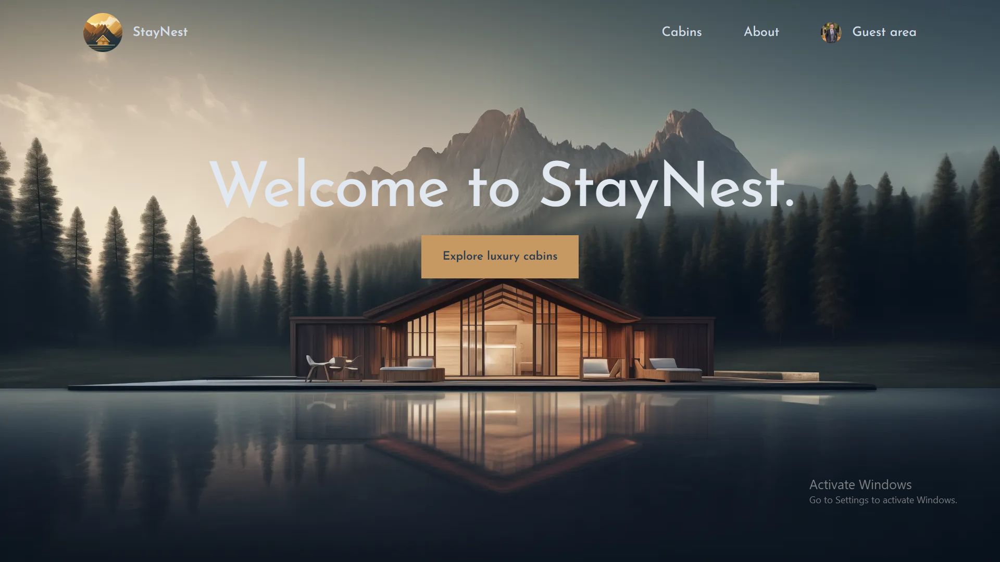
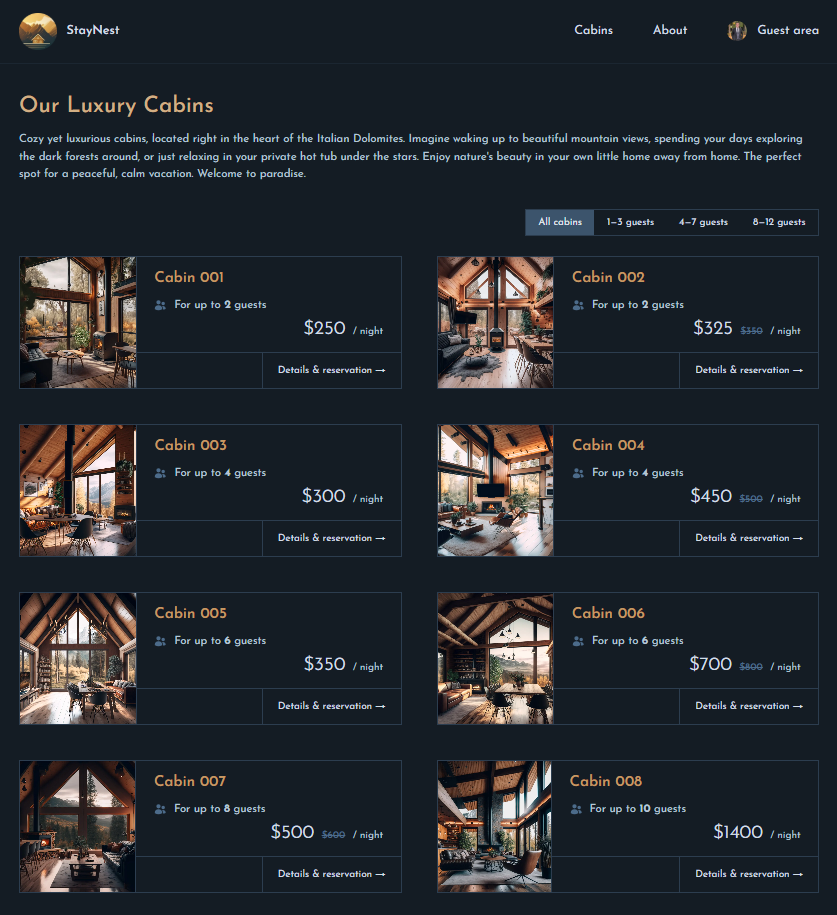
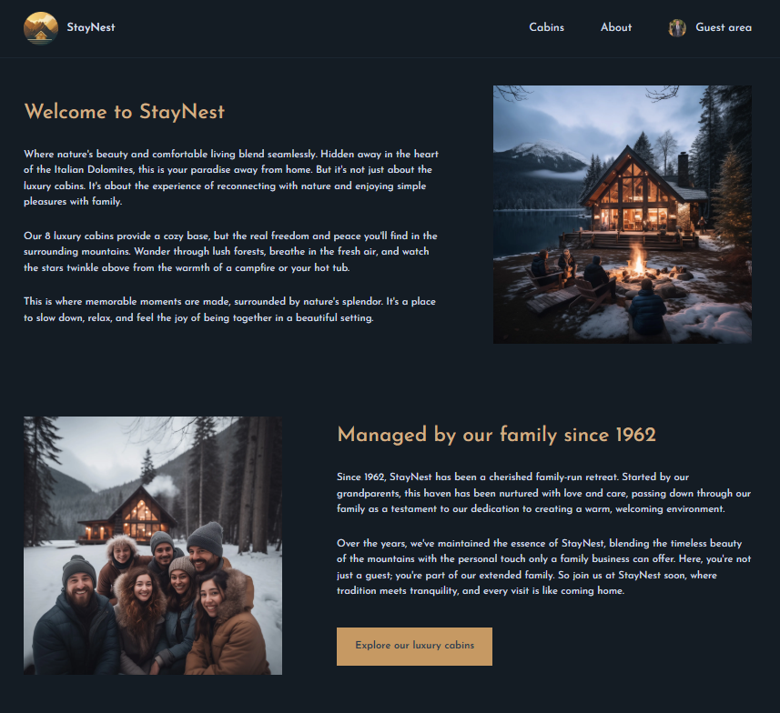
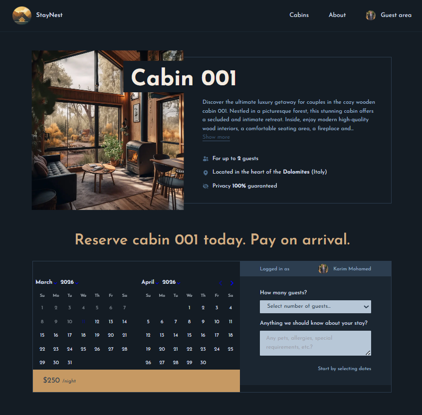
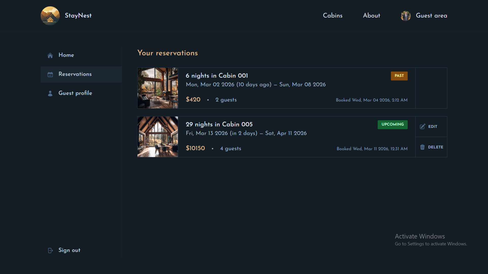
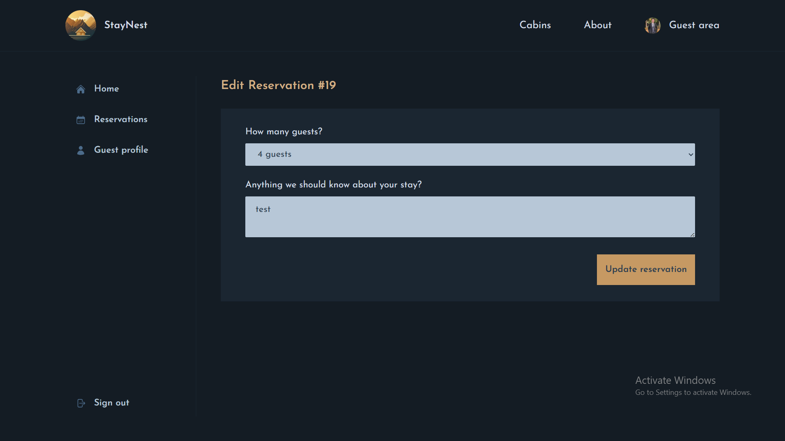
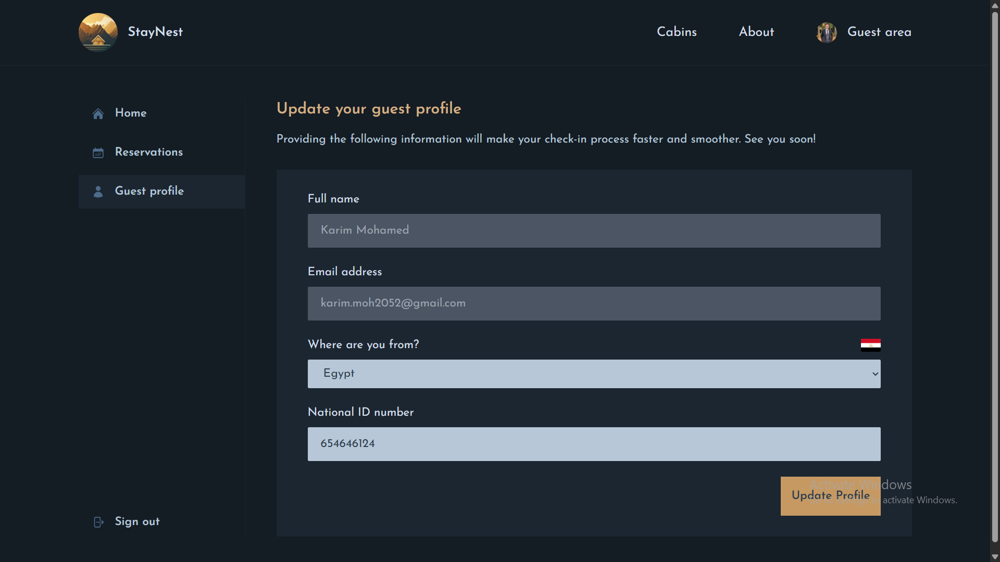

## 🏨 The Wild Oasis — Hotel Management System

The Wild Oasis is a modern hotel reservation web application that allows users to browse cabins, view detailed information, and make reservations through a clean and responsive interface. The project simulates a real hotel booking system and is built using modern web technologies with a scalable, component-based architecture, authentication, and server-side data handling to provide a smooth user experience.

---

## � Built Using

- **Next.js** - React framework for web applications with SSR
- **React** - JavaScript library for user interfaces
- **TypeScript** - Typed superset of JavaScript
- **TailwindCSS** - CSS framework for styling
- **Auth.js** - Authentication Library
- **Supabase** - Backend server and database
- **Vite** - Build Tool
- **react-icons** - Icon Library

---

## 🚀 Live Demo

[The Wild Oasis Live](https://the-wild-oasis-website-omega-khaki.vercel.app/)

---

## 🎥 Demo Video

[The Wild Oasis Video](https://drive.google.com/drive/folders/1vL1zIoLGn4RjzT4bA2uZdFRaHD3APgNF?usp=sharing)

---

## ✨ Features

- 🔐 **User Authentication** - Secure login and signup with Auth.js
- 🏡 **Browse Cabins** - View all available cabins with detailed information and images
- 🔍 **Filter & Search** - Filter cabins by name and other criteria
- 📅 **Make Reservations** - Easy-to-use reservation system with date selection
- 📝 **Manage Reservations** - View, edit, and cancel your bookings
- 👤 **User Profile Management** - Update personal information and profile details
- 📱 **Responsive Design** - Fully responsive UI that works on all devices
- 🎨 **Modern UI** - Built with TailwindCSS for a sleek and professional look

---

## 📸 Screenshots

### Login Page



---

### Home Page



---

### Cabins Page



---

### About Page



---

### Cabin Details & Reservation



---

### Your Reservations



---

### Edit Reservation



---

### Update Profile Page



---

## 🏁 Getting Started

Follow the steps below to run the project locally on your machine.

```bash
1. Clone the repository
  git clone https://github.com/Karim-Mohamed20/the-wild-oasis-website.git
2. Navigate to the project directory
  cd the-wild-oasis-website
3. Install dependencies
  npm install
4. Start the development server
  npm run dev
5. Open the application

Once the server starts, open your browser and visit:

http://localhost:3000
